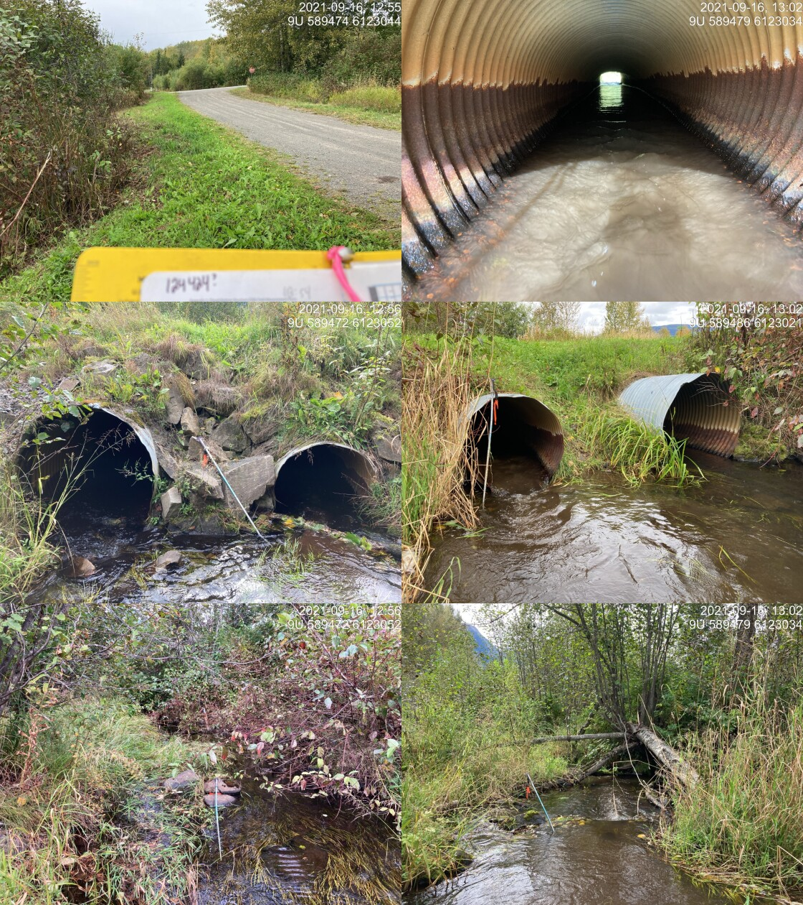
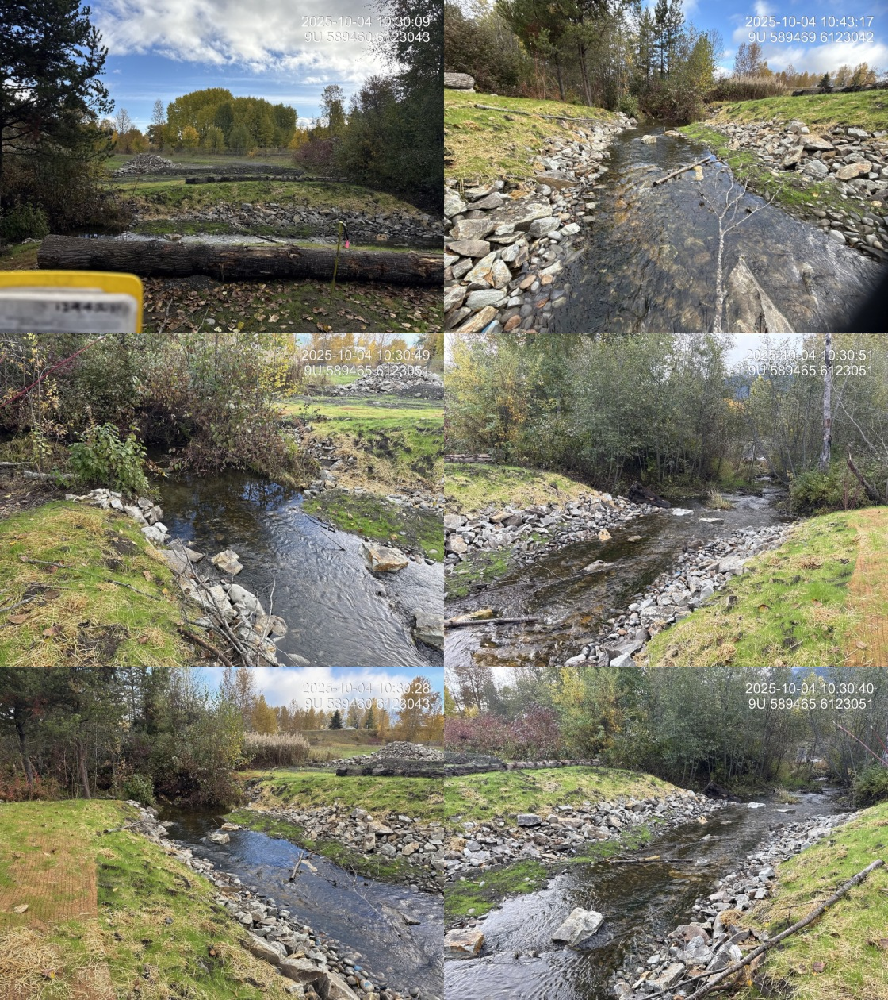
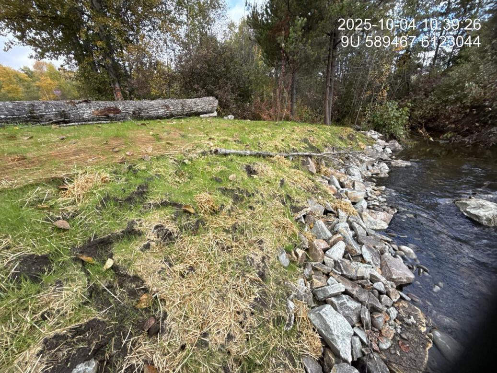

# Waterfall Creek - 124421 - Monitoring Appendix {- #waterfall-2025}

```{r setup-124421, include = FALSE}
my_site_mon <- 124421
```

PSCIS crossing `r as.character(my_site_mon)` on Waterfall Creek is located on 11th Avenue within the Bulkley River watershed group. The culvert at this crossing has been removed by the Gitksan Watershed Authorities, and the site was visited in `r params$project_year` under the effectiveness monitoring program.

<br>

## Crossing Characteristics {.unnumbered}

Before removal, the structure was a round culvert ranked a barrier to upstream migration under the provincial protocol [@moe2011Fieldassessment]. The September 2021 assessment recorded the pipes bent in the middle from road weight and an inlet drop of 0.10 m on both, in a reach described as slow, steady flow through almost wetland habitat above and below the crossing (Figure \@ref(fig:photo-124421-before)).

<br>

The culvert has since been removed. At the `r params$project_year` visit the riprap at the site had been buried with soil and seeded, with good regrowth of grasses established, and shrub planting was planned for the fall (Figure \@ref(fig:photo-124421-after)).

<br>

```{r photo-124421-before, fig.cap = my_caption, out.width = photo_width}
my_caption <- paste0("Culvert on Waterfall Creek at PSCIS crossing ", my_site_mon,
                     " on 11th Avenue, photographed in September 2021 before removal.")

```

<br>

```{r photo-124421-after, fig.cap = my_caption, out.width = photo_width}
my_caption <- paste0("Waterfall Creek at PSCIS crossing ", my_site_mon,
                     " on 11th Avenue, photographed on 2025-10-04 following removal of the culvert.")

```

<br>

```{r photo-124421-reveg, fig.cap = my_caption, out.width = photo_width}
my_caption <- paste0("Revegetation of the buried riprap at PSCIS crossing ", my_site_mon,
                     ", recorded during the ", params$project_year, " effectiveness monitoring visit.")

```

<br>

## Monitoring Form {.unnumbered}

`r params$project_year` effectiveness monitoring form results are summarized in Table \@ref(tab:tab-monitoring-124421).

<br>

```{r tab-monitoring-124421}
tab_monitoring |>
  dplyr::filter(`Pscis Crossing Id` == my_site_mon) |>
  dplyr::mutate(dplyr::across(dplyr::everything(), as.character)) |>
  tidyr::pivot_longer(
    cols = dplyr::everything(),
    names_to = "Variable",
    values_to = "Value"
  ) |>
  fpr::fpr_kable(
    caption_text = paste0("Summary of effectiveness monitoring form results for site ", my_site_mon,
                          " in ", params$project_year, "."),
    scroll = gitbook_on
  )
```

<br>

## Habitat {.unnumbered}

Habitat confirmation assessments were completed at this site in September 2021, before the culvert was removed. Both reaches were rated moderate habitat value, with 120 m surveyed upstream and 50 m downstream, and approximately 1.3 km of upstream habitat length estimated. The site was ranked a moderate priority for remediation.

<br>

The upstream reach was described as a slow-moving wetland-type stream with deep glides throughout, instream vegetation, overhanging vegetation and undercut banks, with gradient increasing slightly and substrate changing from fines and organics to small gravel near the top of the survey. The downstream reach was a defined channel widening into a small wetland complex dominated by tall grasses, with high amounts of instream vegetation and muddy substrate.

<br>

No fish sampling was conducted at this site in 2021, and no environmental DNA samples were collected here in `r params$project_year`.

<br>

## Aerial Imagery {.unnumbered}

An aerial survey was conducted with a remotely piloted aircraft and the resulting imagery was processed into an orthomosaic available to view and download `r if(gitbook_on){knitr::asis_output("in Figure \\@ref(fig:uav-ortho-124421)")}else(knitr::asis_output("[here](https://viewer.a11s.one/?cog=https://imagery-uav-bc.s3.amazonaws.com/skeena/bulkley/2025/124421_waterfall_11th/odm_orthophoto/odm_orthophoto.tif)"))`.

<br>

```{r uav-ortho-124421-prep, eval = gitbook_on}
knitr::asis_output(ngr::ngr_str_viewer_cog("https://imagery-uav-bc.s3.amazonaws.com/skeena/bulkley/2025/124421_waterfall_11th/odm_orthophoto/odm_orthophoto.tif"))
```

```{r uav-ortho-124421, out.width = "0.01%", eval = gitbook_on, fig.cap = my_caption}
my_caption <- paste0("Orthomosaic of Waterfall Creek at PSCIS crossing ", my_site_mon, ".")
knitr::include_graphics("fig/pixel.png")
```

<br>

## Discussion {.unnumbered}

Removing a crossing outright, rather than replacing it, is the most complete form of remediation available and it is uncommon in this program. The `r params$project_year` visit found the site stabilising as intended — riprap buried and seeded, grasses established, shrub planting to follow.

<br>

What the site does not yet have is any direct evidence of fish use, before or after. The 2021 assessment rated the habitat moderate on the basis of channel and cover characteristics rather than observed fish, no electrofishing was conducted, and the site was not part of the `r params$project_year` environmental DNA program. The reach is wetland-type habitat with deep glides, instream vegetation and undercut banks, which the 2021 survey noted transitions to small gravel toward the upper end.

<br>

Recommendations for continued monitoring at this site:

- Collect environmental DNA upstream and downstream of the former crossing. This is the lowest-cost way to establish which species use the reach, and there is currently no fish presence record here at all.

- Continue photographic monitoring of the revegetating riprap and the channel through the former crossing, so recovery can be tracked against the shrub planting.

- Confirm with the Gitksan Watershed Authorities what the planned shrub planting involved and when it was completed, so the revegetation record reflects the work actually done.
