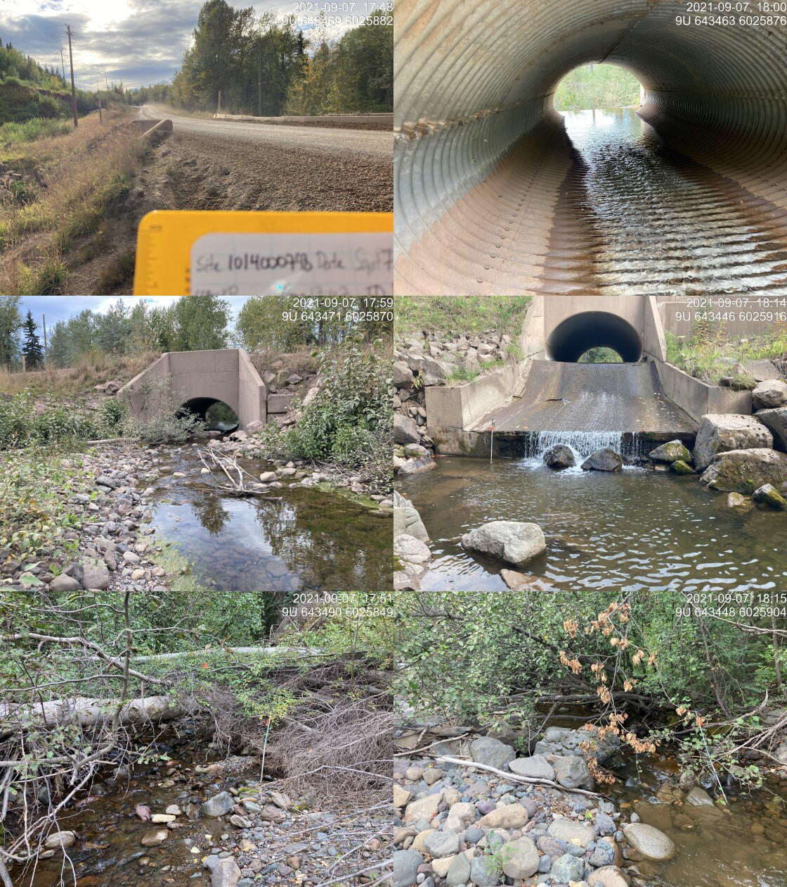
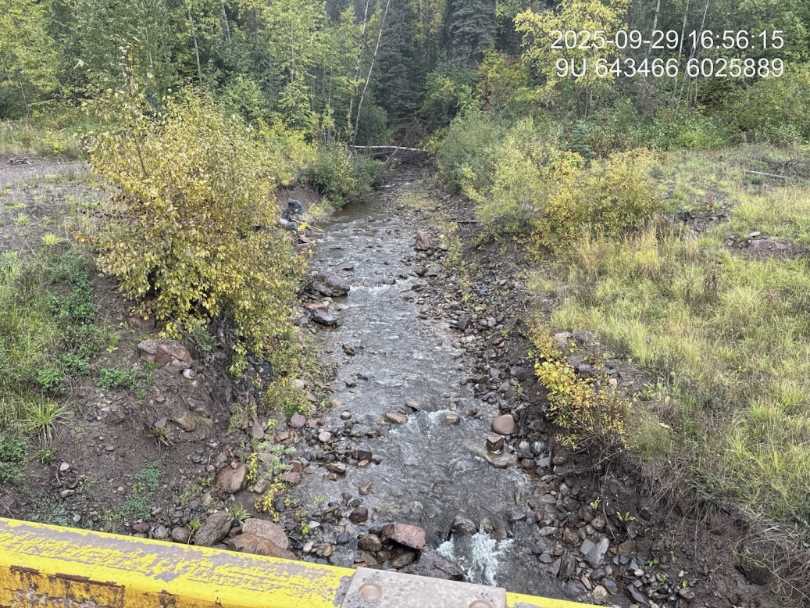
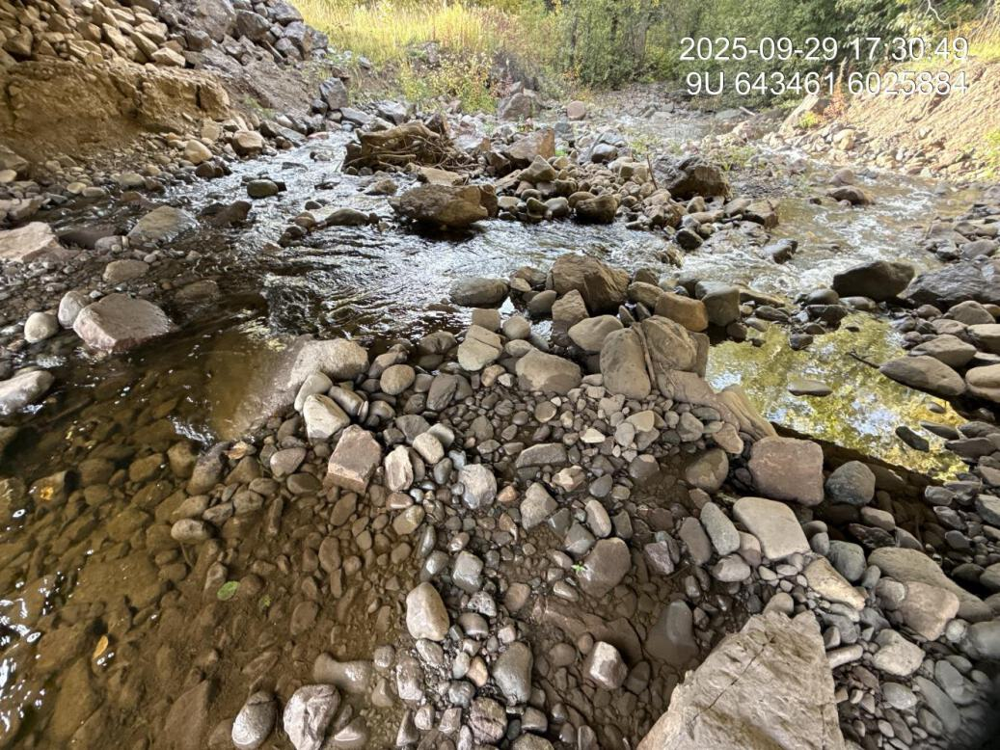

# Peacock Creek - 197962 - Monitoring Appendix {- #peacock-2025}

```{r setup-197962, include = FALSE}
my_site_mon <- 197962
```

PSCIS crossing `r as.character(my_site_mon)` on Peacock Creek is located on the Morice Forest Service Road within the Morice River watershed group. The culvert at this crossing was replaced with a bridge in 2021, and the site was revisited in `r params$project_year` under the effectiveness monitoring program.

<br>

## Crossing Characteristics {.unnumbered}

Before replacement, the structure was a corrugated metal culvert with a concrete headwall, ranked a barrier to upstream migration under the provincial protocol [@moe2011Fieldassessment]. The assessment recorded a partial inlet drop of varying height caused by large woody debris and boulders. Photographs taken during the September 2021 assessment show the outlet perched above a plunge pool, with the drop and the pool visible below the headwall (Figure \@ref(fig:photo-197962-before)).

<br>

The replacement structure is an open-span bridge. Photographs from the `r params$project_year` monitoring visit show an unconstricted channel through the crossing, with the bed continuous through the opening and no residual outlet drop (Figure \@ref(fig:photo-197962-after)).

<br>

```{r photo-197962-before, fig.cap = my_caption, out.width = photo_width}
my_caption <- paste0("Culvert on Peacock Creek at PSCIS crossing ", my_site_mon,
                     " on the Morice FSR, photographed on 2021-09-07 before replacement. ",
                     "The outlet is perched above a plunge pool.")

```

<br>

```{r photo-197962-after, fig.cap = my_caption, out.width = photo_width}
my_caption <- paste0("Channel upstream of the replacement bridge at PSCIS crossing ", my_site_mon,
                     ", photographed on 2025-09-29 from the bridge deck.")

```

<br>

```{r photo-197962-substrate, fig.cap = my_caption, out.width = photo_width}
my_caption <- paste0("Substrate condition through the crossing at PSCIS crossing ", my_site_mon,
                     ", recorded during the ", params$project_year, " effectiveness monitoring visit.")

```

<br>

## Habitat and Fish Presence {.unnumbered}

Habitat confirmation assessments were completed at this site in September 2021, before the culvert was replaced. Both the reach upstream and the reach downstream of the crossing were rated high habitat value, with 750 m surveyed upstream and 600 m downstream. The upstream reach was described as complex habitat with undercut banks, large and small woody debris and pools; the downstream reach as carrying consistent undercut banks with woody debris and overhanging vegetation providing cover. Approximately 4.8 km of upstream habitat length was estimated, and the site was ranked a high priority for remediation.

<br>

The site was electrofished on 2021-09-17 at three closed-site multi-pass locations upstream of the crossing and three downstream. Replacement of the culvert began three days later, on 2021-09-20, so the entire 2021 record — assessment, habitat confirmation and fish sampling — describes the site in its pre-remediation condition.

<br>

In `r params$project_year`, environmental DNA was collected both upstream and downstream of the crossing. Both samples returned detections (Table \@ref(tab:tab-edna-results-197962)). Downstream returned rainbow trout at 124 positive droplets and coho at 8; upstream returned bull trout at 84 positive droplets and coho at 6. Chinook and sockeye returned zero positive droplets in every run at both locations.

```{r tab-edna-results-197962-prep, include = FALSE}
edna_results_197962 <- edna_bystargets |>
  dplyr::filter(grepl(paste0("^(", my_site_mon, ")_"), site_id),
                !control_blank_field, !control_blank_office) |>
  dplyr::group_by(site_id) |>
  dplyr::summarise(
    `UNBC ID`       = paste(sort(unique(unlist(strsplit(lab_ids, ", ")))), collapse = ", "),
    `Detected`      = fmt_targets(target[any_clean], max_pos[any_clean], retested[any_clean]),
    `Sub-threshold` = fmt_targets(target[any_crude & !any_clean],
                                  max_pos[any_crude & !any_clean],
                                  retested[any_crude & !any_clean]),
    `Not detected`  = fmt_targets(target[!any_crude], max_pos[!any_crude], retested[!any_crude]),
    .groups = "drop"
  ) |>
  dplyr::rename(`Site ID` = site_id)
```

```{r tab-edna-results-197962}
edna_results_197962 |>
  fpr::fpr_kable(
    caption_text = paste0("Environmental DNA detection results at PSCIS crossing ", my_site_mon,
                          ", upstream and downstream of the crossing."),
    scroll = FALSE
  )
```

<br>

Internal amplification controls were not reported for either sample. The detections are unaffected — a well returning positive droplets demonstrably amplified — but the chinook and sockeye zeros cannot be distinguished from reactions that failed or were inhibited, and should not be read as evidence of absence.

<br>

## Discussion {.unnumbered}

The evidence at this site is consistent across methods and across four years, which is not the usual outcome of effectiveness monitoring. The pre-remediation habitat confirmation rated both reaches high value and estimated 4.8 km of habitat upstream; the `r params$project_year` environmental DNA confirms that the upstream reach is occupied, by bull trout and coho, and that the downstream reach carries rainbow trout and coho. The species detected upstream differ from those detected downstream, which is worth resolving rather than assuming: it may reflect real distribution, or the limits of a single grab sample at each location.

<br>

Recommendations for continued monitoring at this site:

- Resample for environmental DNA at both locations across multiple points in the season, so detections can be read against flow rather than as single observations. The `r params$project_year` samples were collected on one day at the end of September.

- Add rainbow trout to the upstream assay panel and bull trout to the downstream panel, so the two locations are directly comparable. As sampled, each location was assayed for a different set of targets, which is enough on its own to explain the difference between them.

- Confirm with the laboratory whether amplification control results exist for these samples. If the controls were run and simply not returned, the chinook and sockeye zeros can be interpreted without resampling.

- Repeat the electrofishing conducted in 2021 at the same closed-site locations. Pre-remediation multi-pass data exist for three sites upstream and three downstream, which is an uncommonly strong baseline and the most direct available measure of whether the replacement changed fish use rather than only passage condition.

- Continue photographic monitoring of substrate, cover, bank stability and revegetation through the crossing, so channel recovery following construction can be tracked over time.
